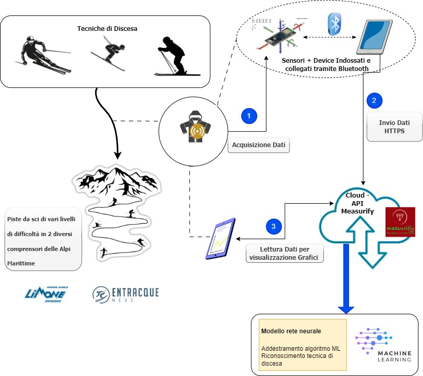
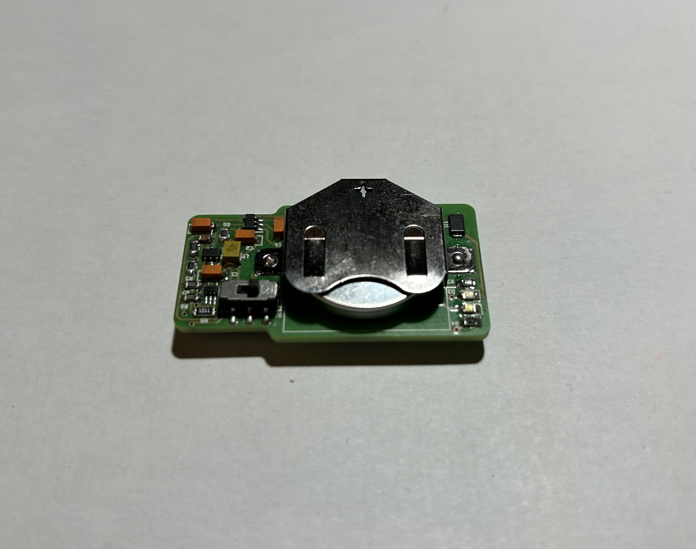
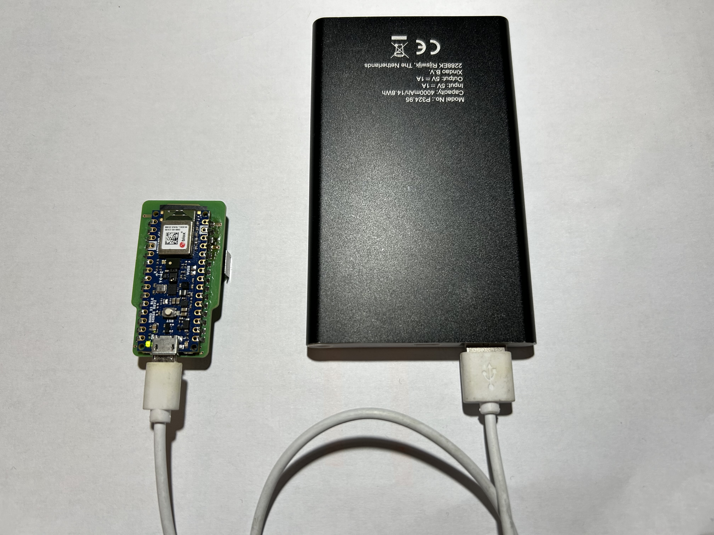
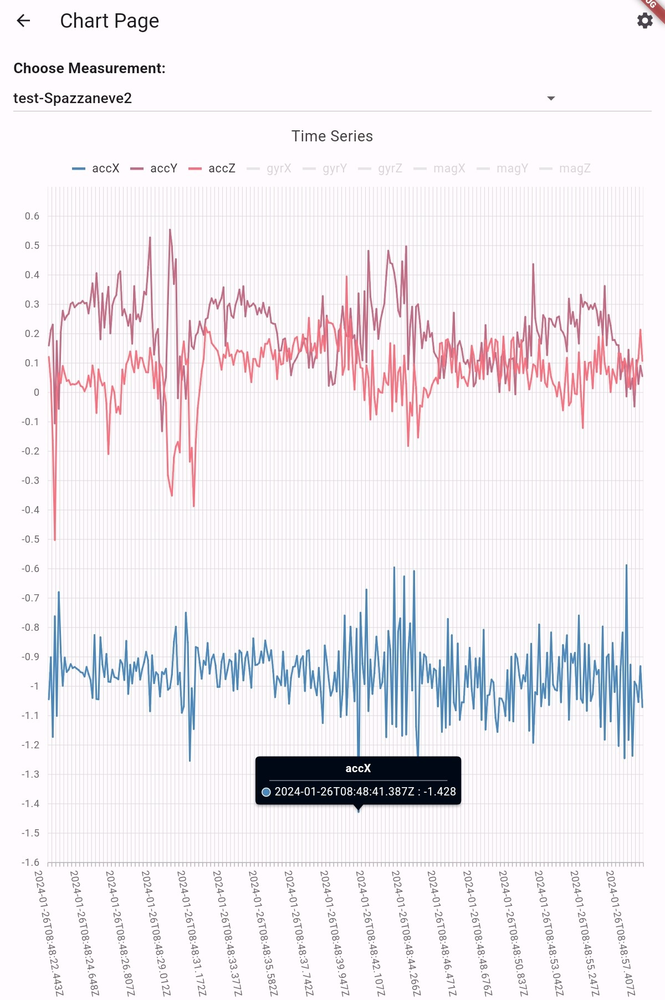

# Design and development of an embedded system for ski activity recognition

## Overview
The system is aimed at collecting
relevant data obtained from the sensors of an Arduino electronic board, and then to train a
machine learning algorithm, capable of autonomously identifying specific techniques in the context of skiing activity.
To achieve this, an Arduino Nano BLE device was employed, which collects the
accelerometer, gyroscope and magnetometer values during a descent down a ski slope,
focusing, in our case, on different skiing techniques such as slalom, snowplough, egg position
and pushing. The acquired data is transmitted to a mobile device connected to the circuit board via
Bluetooth Low Energy (BLE) technology, via an application developed using the Flutter framework.
Finally, the data is sent to an API Framework called [Measurify](https://measurify.org/).

## Hardware
The board used is a [Arduino Nano 33 BLE Sense](https://docs.arduino.cc/hardware/nano-33-ble-sense)

## Software
The necessary code is:
1. Edge-meter script on [Arduino IDE](https://www.arduino.cc/en/software)
2. Flutter code of Smart Collector APP on [VSCode](https://code.visualstudio.com/)
3. Machine learning model developed by the laboratory [Elios Lab](https://elios.diten.unige.it/)

## Quick start
To setup the embedded system, the following steps need to be followed:
1. Install Arduino IDE and open the edge-meter script (probably you need to install some libraries), then connect the Arduino via cable connection to the computer, selecting from the Arduino IDE menu *Serial Port* your Arduino and the cable to which it is connected; for the last step click the botton upload to load the script on the board. The Arduino board is able to work without the need for cables thanks of his custom battery implementation but for complete efficiency throughout the day, it is recommended to adapt the cable use of a powerbank.
2. Install Visual Studio Code and the Flutter plugin; open the *quick_blue_example* folder from the *smart-collector-main* folder then connect a mobile device via cable to run the app on it (developer mode must be activated on the device with "Debug USB" enabled). Finally, to load the code, select the device from the banner and the 'Run without debugging' button, the application will be open on the mobile device.
3. Activate the Arduino board, start the scan in the first page of the app and select the "Measurify-Meter" device; in the next page connect the device. In the Start page select the technique you want to record, insert the name of the measurement and select the option IMU then start the recording with the appropriate button; at the end of the measurement the 'Stop and Send' button will collect the data and send them to Measurify automatically.
4. Open the Chart Page with the button on the Start Page and choose the measurement you want to display in the interactive graph.
   
6. Once you have trained the model with the data sent to Measurify for each technique, you can proceed with testing it; you can do the tests with the same procedure. For the final step you can see the results of the tests with the classifier model *Action_Modeler_Classifier_Ski*. 
      
   
 
